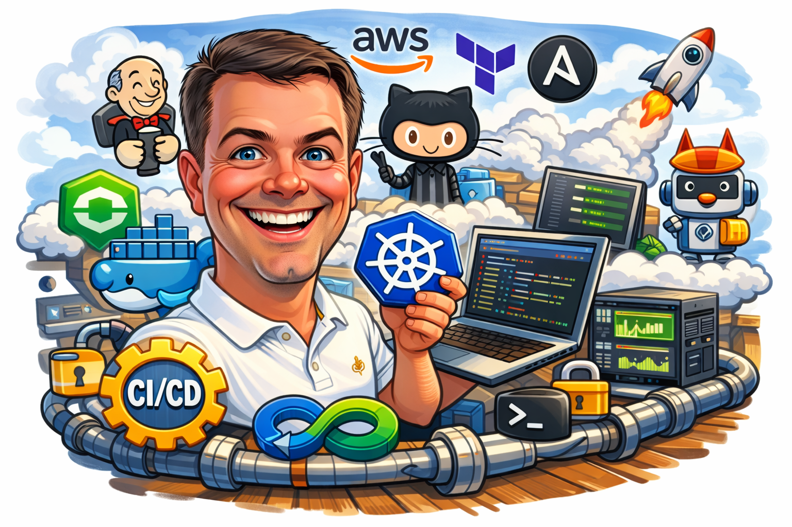

<!-- =================== HEADER: Animated Typing SVG =================== -->

  

<!-- =================== HERO IMAGE =================== -->

  

<h1 align="center">👋 I'm Dmytro Dmytrush</h1>

---

<h2 align="center">☁️ DevOps Engineer</h2>
<h4 align="center">AWS &nbsp;|&nbsp; Linux &nbsp;|&nbsp; Docker &nbsp;|&nbsp; Kubernetes &nbsp;|&nbsp; GitOps &nbsp;|&nbsp; Cloud Infrastructure</h4>

<i>I build and automate scalable cloud infrastructure, design CI/CD pipelines,  
and turn manual ops work into reliable, observable systems.</i>

---

### 🛠️ Languages & Tools

#### ☁️ Cloud Platforms

  &nbsp;
  &nbsp;
  &nbsp;
  

#### 🏗️ Infrastructure as Code & Configuration

  &nbsp;
  &nbsp;
  &nbsp;
  

#### 🐳 Containers & Orchestration

  &nbsp;
  &nbsp;
  &nbsp;
  

#### 🔄 CI/CD & GitOps

  &nbsp;
  &nbsp;
  &nbsp;
  

#### 📊 Monitoring & Observability

  &nbsp;
  &nbsp;
  &nbsp;
  

#### 💻 Languages & Scripting

  &nbsp;
  &nbsp;
  &nbsp;
  

#### 🐧 OS, Networking & Web

  &nbsp;
  &nbsp;
  &nbsp;
  

---

### 📈 GitHub Stats

  
  

  

---

### 🤝 Connect With Me

  
  
  

---

  

  <i>💬 Feel free to reach out if you want to collaborate, talk shop about cloud architecture,  
  or just chat about the latest in DevOps. Always happy to connect with fellow engineers!</i>

---

<!-- Visitor counter -->

  

